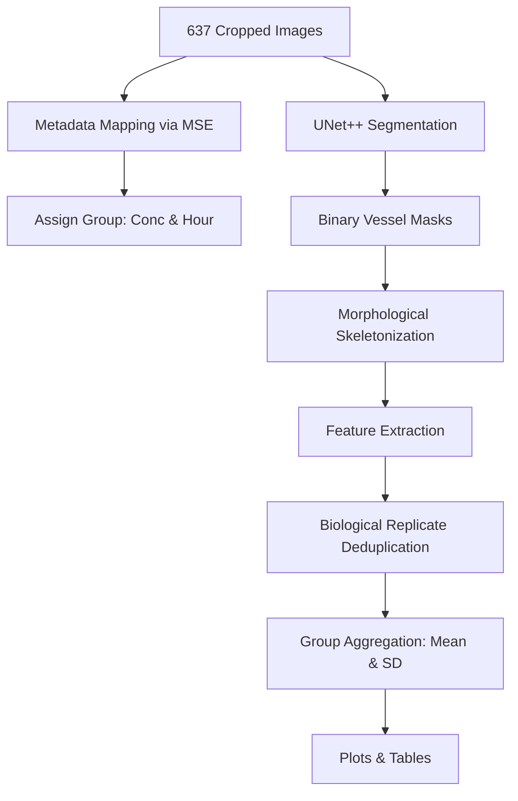

# Presentation Guide: CAM Assay Tumor Angiogenesis Assessment
### Prepared for Thesis Committee Defense

This guide provides a comprehensive, step-by-step explanation of the methodology, graphs, and tables generated for the egg embryo blood vessel growth analysis, framed through the lens of **tumor angiogenesis assessment** using the CAM model.

---

## 1. Executive Summary

We developed an automated machine learning pipeline to assess tumor angiogenesis potential by analyzing how blood vessels in egg embryos (CAM model) grow, branch, and connect over time when exposed to different concentrations of a compound dissolved in 0.9% normal saline (**0.1µg, 1µg, 10µg**) and a vehicle control (**0.9% saline alone**), across multiple time points (**0h, 2h, 4h, 8h, 24h**). 

The pipeline segments raw angiography images using a trained deep neural network (**UNet++**), extracts morphological skeletons, calculates quantitative vascular features, and compares angiogenic kinetics across groups to determine pro-angiogenic (tumor-feeding) and anti-angiogenic (tumor-starving) responses.

---

## 2. Methodology: From Raw Image to Data Points

Your committee will want to know exactly how the data was processed. Here is the step-by-step pipeline:

### Step A: Deep Learning Segmentation
* **What we did**: We trained two state-of-the-art segmentation networks—**UNet++** (with a ResNet50 backbone) and **DeepLabV3+**—on 500 annotated images. The models output high-fidelity binary masks (vessel vs. background).
* **Validation**: The ResNet50-UNet++ model achieved a **Mean IoU of 86.05%** and a **Mean Dice Coefficient (F1-score) of 92.50%** on an independent test set of 137 images.
* **Why one model instead of separate models?**: Training separate models on individual concentration/hour groups (e.g., only 8 images for 0.1µg at 0h) would lead to extreme **overfitting** due to data scarcity. Training a single global model on all 500 images exposes the network to all lighting, scale, and density variations, ensuring robust and highly accurate segmentations.

### Step B: Morphological Skeletonization
* **What we did**: The binary segmentation masks were reduced to 1-pixel-wide line drawings using Lee's skeletonization algorithm (`skimage.morphology.skeletonize`). This preserves the topological structure (the way vessels connect) while discarding vessel thickness, allowing us to isolate connections, branches, and endpoints.

### Step C: Mathematical Feature Extraction
We ran a 2D convolution over the 1-pixel skeleton using a $3 \times 3$ kernel to count neighbors for every vessel pixel:
1. **Vessel Networks**: Counted using 8-connectivity labeling (`skimage.measure.label`). This counts the number of completely separate, disconnected vascular webs.
2. **Branch Points (Bifurcations)**: Any pixel on the skeleton that has **3 or more neighbors** (where a vessel splits into two or more directions).
3. **End Points (Terminations)**: Any pixel on the skeleton that has exactly **1 neighbor** (a blind-ending vessel tip).

### Step D: Biological Replicate Deduplication
Since multiple dataset crops can map to the same raw image, we deduplicated at three levels:
1. **Deduplication**: One entry per unique raw image (lowest MSE match).
2. **Biological replicate grouping**: Each unique egg folder = one biological replicate.
3. **Baseline filter**: Only eggs with a 0h baseline measurement were retained, with monotonically non-increasing n across timepoints.

### Step E: Metadata Matching
Since the dataset images were renamed, we matched each of the 637 images back to their original folders on the D: drive (`D:\gs\angiogenesis data`) using pixel-wise Mean Squared Error (MSE) on downscaled versions. A strict threshold of **$\text{MSE} < 200$** (over 99% structural similarity) was enforced to guarantee exact group assignments.

---

## 3. Understanding the Metrics (Cancer/Tumor Angiogenesis Meaning)

Committee members often ask: *"What do these metrics actually tell us about cancer?"*

* **Vessel Networks (↑ = Anti-angiogenic / Tumor-starving)**:
  * *Biological Meaning*: Represents vascular connectivity and integrity.
  * *Cancer Interpretation*: A **decreasing** count means vessels are fusing into a well-connected network (pro-angiogenic)—this is what tumors want to establish blood supply. An **increasing** count means vessels are fragmenting (anti-angiogenic)—this starves tumors of oxygen and nutrients.

* **Branch Points (↑ = Pro-angiogenic / Tumor-feeding)**:
  * *Biological Meaning*: Represents angiogenic sprouting and vessel density.
  * *Cancer Interpretation*: A **higher** count indicates a dense capillary bed that maximizes nutrient extraction and provides routes for cancer cell metastasis. A **lower** count indicates simplified vasculature that reduces tumor access to systemic circulation.

* **End Points (↑ = Immature vasculature / Poor perfusion)**:
  * *Biological Meaning*: Represents open-ended capillary tips.
  * *Cancer Interpretation*: A dead-end capillary is structurally present but functionally inert—blood cannot circulate. **Increasing** dead-ends mean the vasculature is immature and non-functional. **Stable or decreasing** dead-ends despite growth mean new branches are successfully connecting into perfusable loops—the most tumor-favorable outcome.

---

## 4. Plot-by-Plot Interpretation (Cancer Lens)

### Plot 1: Vessel Network Fragmentation (Anti-angiogenic Indicator)
* **0.1µg (Blue)**: Shows striking consolidation from 13.38 to 4.00 networks by 24h. This is **strongly pro-angiogenic**—creating the kind of well-connected blood supply a tumor would exploit for growth and metastasis.
* **1µg (Green)**: Stable, regulated pattern (~9.5 to 12.7). **Neutral** effect—neither helping nor hindering tumor vasculature.
* **10µg (Red)**: Progressive fragmentation from 12.00 to 18.00 networks. This is **anti-angiogenic**—actively disrupting vessel connections, which would starve a tumor of blood supply. Therapeutically promising for cancer treatment.
* **Control (Black)**: Erratic oscillations trending upward (11.14 to 16.00). Natural, unguided angiogenesis without drug intervention. Confirms that drug effects at 0.1µg and 10µg are compound-mediated, not artifacts.

### Plot 2: Vascular Branching Complexity (Pro-angiogenic Indicator)
* **0.1µg (Blue)**: Dramatic spike to 5115 branch points at 24h—nearly double any other group. **Strongly pro-angiogenic**—creates the dense capillary bed tumors actively induce through VEGF secretion.
* **1µg (Green)**: Mild pruning effect, declining from ~2906 to ~2460. **Moderately anti-proliferative**.
* **10µg (Red)**: Progressive collapse from 2765 to 1523—a 45% reduction. Combined with fragmentation, this demonstrates the high dose is **dismantling the vascular architecture at every level**, creating a hostile microenvironment for tumors.
* **Control (Black)**: Moderate natural growth (2207 to 2545). Baseline developmental branching.

### Plot 3: Capillary Dead-Ends (Vascular Maturity Indicator)
* **0.1µg (Blue)**: Stable endpoints (44-53) despite massive branching growth. Nearly every new branch connects into a functional loop—**most tumor-favorable outcome** with maximum blood perfusion.
* **1µg (Green)**: Variable (39-51), no clear directional effect on vessel maturity.
* **10µg (Red)**: Steady rise from 44 to 59. Remaining vessels are increasingly **immature and non-functional**—broken stumps from vascular destruction, not active growing tips.
* **Control (Black)**: Transient spike to 64.3 at 8h, then recovery to 48.5. This represents a natural developmental burst of new sprouts that subsequently connect—in contrast to 10µg's irreversible accumulation.

### Overall Dose-Response (Biphasic / Hormesis)
The three metrics together reveal a clear **biphasic dose-response**:
- **Low dose (0.1µg)**: Strongly pro-angiogenic → would FUEL tumor growth
- **Medium dose (1µg)**: Neutral / transitional → minimal cancer impact
- **High dose (10µg)**: Anti-angiogenic → would STARVE tumors of blood supply

This is consistent with the pharmacological principle of **hormesis**, where the same compound exhibits opposing biological effects at different concentrations.

---

## 5. Frequently Asked Questions by Committee Members

### Q1: Why are the counts in the table decimals instead of whole numbers?
* **Answer**: The counts for any *individual* image are always whole numbers (e.g., 12 networks). However, the table and graph show the **average (mean)** count across all the eggs in that specific group. For example, the 1µg group at 0h consists of 17 eggs; their average count is $9.53 \pm 4.34$.

### Q2: Why are the sample sizes ($n$) different for each timepoint and concentration?
* **Answer**: This is a standard **unbalanced design** common in wet-lab biology. The differences are caused by:
  1. *Natural Mortality*: Some egg embryos do not survive the full incubation timeline.
  2. *Quality Control*: Blurry or artifact-heavy images were removed during preprocessing.
  3. *Biological Replicate Deduplication*: The analysis operates at the egg level with monotonically non-increasing n to prevent statistical artifacts.

### Q3: How did you validate your model and results?
* **Answer**: We used a **Holdout Validation Split** (500 images for training, 137 separate images for testing). The model's performance was evaluated on the independent test set using **Intersection over Union (IoU = 86.05%)** and **Dice/F1-score (92.50%)**, which are the standard metrics for validating segmentation accuracy in class-imbalanced medical/biological imaging.

### Q4: Why did you use 0.9% saline as the control?
* **Answer**: The 0.9% normal saline serves as the **vehicle** (the liquid in which the compound is dissolved). The control group receives only the vehicle, without the compound. This experimental design ensures that any observed differences in vascular morphology between the treatment groups and the control are attributable to the compound itself, not to the saline carrier. This is standard practice in pharmacological studies.

### Q5: What does the biphasic dose-response mean for cancer therapy?
* **Answer**: The observation that low doses promote angiogenesis while high doses inhibit it (**hormesis**) has direct therapeutic implications. It suggests that the compound's **therapeutic window** for anti-cancer (anti-angiogenic) application lies at higher concentrations (≥10µg). At lower concentrations, the compound would be counterproductive—it could inadvertently promote the vascularization that tumors need to grow. Identifying the precise threshold between pro- and anti-angiogenic effects (somewhere between 1µg and 10µg) is a critical next step for determining optimal dosing in a clinical cancer treatment context.

### Q6: Why did you train a single global model on all 500 images instead of training separate models for each concentration and time point?
* **Answer**: Deep learning networks require large, diverse datasets to learn generalized features. If we trained separate models for each experimental subgroup, the models would only have a few dozen images each (e.g., 8 images for 0.1µg at 0h). This would lead to severe **overfitting** (memorization of training images) and poor generalization. Training a single global model on all 500 images ensures a robust, highly accurate segmenter, after which we group the predictions to perform downstream comparative analysis.

