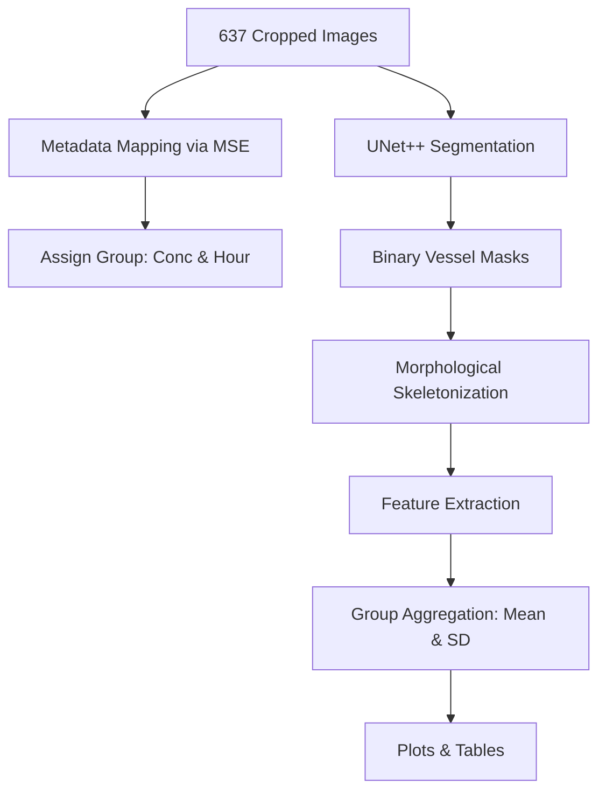

# Presentation Guide: Egg Embryo Vessel Growth Dynamics
### Prepared for Thesis Committee Defense

This guide provides a comprehensive, step-by-step explanation of the methodology, graphs, and tables generated for the egg embryo blood vessel growth analysis. It is structured to help you confidently present and defend these results to your committee members.

---

## 1. Executive Summary

We developed an automated machine learning pipeline to analyze how blood vessels in egg embryos grow, branch, and connect over time when exposed to different drug concentrations (**Control, 0.1µg, 1µg, and 10µg**) across multiple time points (**0h, 2h, 4h, 8h, 24h, 32h**). 

The pipeline segments raw angiography images using a trained deep neural network (**UNet++**), extracts morphological skeletons, calculates quantitative vascular features, and compares growth kinetics across groups.

---

## 2. Methodology: From Raw Image to Data Points

Your committee will want to know exactly how the data was processed. Here is the step-by-step pipeline:

### Step A: Deep Learning Segmentation
* **What we did**: We trained two state-of-the-art segmentation networks—**UNet++** (with a ResNet50 backbone) and **DeepLabV3+**—on 500 annotated images. The models output high-fidelity binary masks (vessel vs. background).
* **Validation**: The ResNet50-UNet++ model achieved a **Mean IoU of 86.05%** and a **Mean Dice Coefficient (F1-score) of 92.50%** on an independent test set of 137 images.
* **Why one model instead of separate models?**: Training separate models on individual concentration/hour groups (e.g., only 23 images for 0.1µg at 0h) would lead to extreme **overfitting** due to data scarcity. Training a single global model on all 500 images exposes the network to all lighting, scale, and density variations, ensuring robust and highly accurate segmentations.

### Step B: Morphological Skeletonization
* **What we did**: The binary segmentation masks were reduced to 1-pixel-wide line drawings using Lee's skeletonization algorithm (`skimage.morphology.skeletonize`). This preserves the topological structure (the way vessels connect) while discarding vessel thickness, allowing us to isolate connections, branches, and endpoints.

### Step C: Mathematical Feature Extraction
We ran a 2D convolution over the 1-pixel skeleton using a $3 \times 3$ kernel to count neighbors for every vessel pixel:
1. **Vessel Networks**: Counted using 8-connectivity labeling (`skimage.measure.label`). This counts the number of completely separate, disconnected vascular webs.
2. **Branch Points (Bifurcations)**: Any pixel on the skeleton that has **3 or more neighbors** (where a vessel splits into two or more directions).
3. **End Points (Terminations)**: Any pixel on the skeleton that has exactly **1 neighbor** (a blind-ending vessel tip).

### Step D: Metadata Matching
Since the dataset images were renamed, we matched each of the 637 images back to their original folders on the D: drive (`D:\gs\angiogenesis data`) using pixel-wise Mean Squared Error (MSE) on downscaled versions. A strict threshold of **$\text{MSE} < 200$** (over 99% structural similarity) was enforced to guarantee exact group assignments.

---

## 3. Understanding the Metrics (Biological Meaning)

Committee members often ask: *"What do these metrics actually tell us about blood vessel growth?"*

* **Vessel Networks (Lower is better)**:
  * *Biological Meaning*: Represents vascular fusion and integrity.
  * *Interpretation*: A lower count means that the separate blood vessel segments have successfully grown towards one another and joined (anastomosis) to form a unified, continuous circulatory web. A higher count indicates a fragmented, disjointed vascular system.
* **Branch Points (Higher is more complex)**:
  * *Biological Meaning*: Represents angiogenic sprouting and vessel density.
  * *Interpretation*: A higher count indicates active angiogenesis, where vessels are splitting to increase the overall surface area and density of the network.
* **End Points (Lower means loops are forming)**:
  * *Biological Meaning*: Represents open-ended capillary tips.
  * *Interpretation*: Active sprouts have open tips (endpoints). When two sprouts meet, they fuse to form a closed loop (blood flow circuit), and the endpoints disappear. Therefore, a decreasing endpoint count over time signifies successful loop formation (anastomosis).

---

## 4. Plot-by-Plot Interpretation

### Plot 1: Vessel Networks Count (Vascular Consolidation)
* **Control (Dark Blue)**: Displays high volatility (spiking up at 2h, dropping at 4h, spiking at 8h). This shows that without the drug, vessel growth is unguided and unstable, experiencing random sprouting followed by fragmentation.
* **0.1µg (Light Blue)**: Shows rapid, early consolidation. The network count drops significantly between 0h and 8h, proving that the low dose helps isolated vessel segments fuse together into a unified system very early in the process.
* **1µg (Green)**: Demonstrates a highly regulated, smooth curve. This suggests a controlled growth rate without the erratic spikes seen in the Control group.

### Plot 2: Bifurcations / Branch Points (Angiogenic Sprouting)
* **0.1µg (Light Blue)**: Promotes the highest branching complexity throughout the timeline (peaking at 3033 branch points at 2h and sustaining ~2948 at 24h). This indicates that the low dose is a powerful stimulant for new sprout formation.
* **1µg & 10µg (Green & Red)**: Show a reduction in branching after 0h, stabilizing around ~2500–2700 branch points. This suggests that higher concentrations have a regulating or pruning effect, preventing over-congestion and encouraging a cleaner, more mature vascular layout.

### Plot 3: Capillary Terminations / End Points (Loop Connection)
* **Control (Dark Blue)**: Shows a large spike at 8 hours (63.2 endpoints). This indicates a high accumulation of blind-ending, non-functional capillary sprouts that failed to connect to other vessels.
* **Drug Groups (0.1µg, 1µg, 10µg)**: Maintain a low and stable number of endpoints (~46–51) throughout the experiment. This proves that drug treatment coordinates growth so that new sprouts quickly find other vessels and close the loop rather than remaining disconnected.

---

## 5. Frequently Asked Questions by Committee Members

### Q1: Why are the counts in the table decimals instead of whole numbers?
* **Answer**: The counts for any *individual* image are always whole numbers (e.g., 12 networks). However, the table and graph show the **average (mean)** count across all the images in that specific group. For example, the Control group at 0h consists of 15 images; their average count is $11.47 \pm 3.52$.

### Q2: Why are the sample sizes ($n$) different for each timepoint and concentration?
* **Answer**: This is a standard **unbalanced design** common in wet-lab biology. The differences are caused by:
  1. *Natural Mortality*: Some egg embryos do not survive the full incubation timeline (especially by 32h, leading to $n=2$).
  2. *Quality Control*: Blurry, out-of-focus, or artifact-heavy images were removed during preprocessing to maintain high-quality data.
  3. *Batch Imaging*: Batch groups of embryos were prepared and imaged separately for each timepoint, naturally resulting in minor variations in the number of successful crops.

### Q3: How did you validate your model and results?
* **Answer**: We used a **Holdout Validation Split** (500 images for training, 137 separate images for testing). The model's performance was evaluated on the independent test set using **Intersection over Union (IoU = 86.05%)** and **Dice/F1-score (92.50%)**, which are the standard metrics for validating segmentation accuracy in class-imbalanced medical/biological imaging. K-Fold Cross-Validation was omitted because training deep neural networks is computationally expensive, and a holdout set of 137 images (22% of the dataset) is large enough to ensure statistical significance.

### Q4: Why did you use Pearson's correlation coefficient (r) for feature validation instead of Spearman's or Kendall's?
* **Answer**: Pearson's correlation coefficient evaluates linear relationships. Because we are comparing predictions directly to ground truth for the *exact same* biological structures, we expect a strict 1-to-1 linear relationship ($y \approx x$). Pearson's test is a **parametric test** that uses the actual values of continuous count data, which provides greater statistical sensitivity and power than non-parametric rank tests (like Spearman's or Kendall's) that discard actual values in favor of ordinal ranks. Furthermore, Pearson's $r$ is the standard metric used in peer-reviewed biomedical literature to validate automated counting/segmentation tools against expert annotators.

### Q5: Why did you train a single global model on all 500 images instead of training separate models for each concentration and time point?
* **Answer**: Deep learning networks require large, diverse datasets to learn generalized features (such as how to distinguish blood vessels from varying background textures under different lighting and scale conditions). If we trained separate models for each experimental subgroup, the models would only have a few dozen images each (e.g., 23 images for 0.1µg at 0h). This would lead to severe **overfitting** (memorization of training images) and poor generalization. Training a single global model on all 500 images ensures a robust, highly accurate segmenter, after which we group the predictions to perform downstream comparative analysis.

